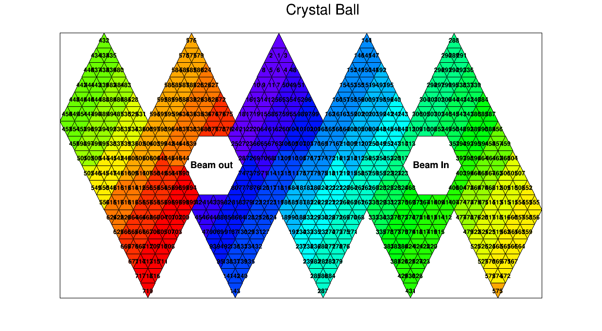
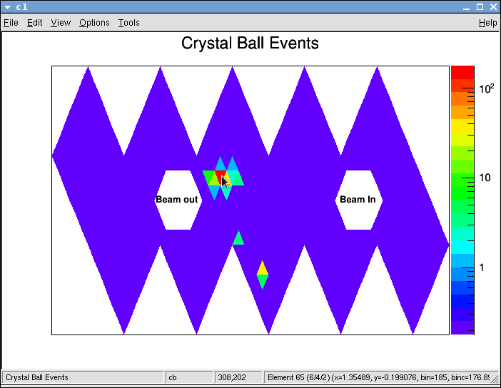

a2display
=========

Detector Display Histograms for A2



Installation
-----

```sh
  git clone https://github.com/osteffen/a2display.git
  cd a2display
  mkdir build
  cd build
  cmake ..
  make
```

How to use
----------

This creates a ''liba2display.so''. This file can be loaded in a ROOT session:
```c++
  gSystem->Load("liba2display.so");
```
After that the two histogram classes `TH2CB` and `TH2TAPS` are available.
Every crystal can be accessed via `SetElement()` or `GetElement()` by the element number.
The numbering is identical to what AcquROOT uses in current config files.
A full set of crystal values can be set at once by providing a `std::vector<Double_t>` or a `TH1`.
This allows creating 2D representations of crystal hit distributions directly from 1D histograms as used by AcquROOT.

In addition, there are the wrapper classes that pull data from existing `TH1` histograms automatically by name:
`PollingHistogram<TH2CB>` and `PollingHistogram<TH2TAPS>`. Specify a name of a `TH1` in the constructor and the data will
be copied over periodically in the background. This can directly be used in any AcquROOT/AcquDAQ session
without interfering. For example, attaching a `PollingHistogram<TH2CB>` to the `NaIHits` histogram in an AcquDAQ session will
show you the accumulated distribution of hits in the current run.

The Event Statusbar of the ROOT canvas shows useful information about the crystal the mouse pointer points to.
For Crystal Ball the Element Number as well as the Major/Minor/Crystal numbers are shown, which can be useful for debugging.
Make sure to turn on the Event Statusbar by clicking `View -> Event Statusbar`.



The examples folder contains simple root macros that demonstrate how it works.
